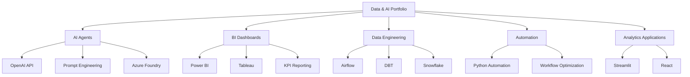

<!--
  Website-style README for Suyesha Lamne
  Note: The hover effects below work in Markdown renderers that allow custom CSS.
  GitHub README pages may strip custom 

<section class="hero">

# 👩‍💻 Suyesha Lamne

## AI Engineer • BI Engineer • Data Engineer • Data Analyst

Building AI agents, analytics automation, BI dashboards, and scalable data solutions that turn business problems into reliable, data-driven products.

  <a href="https://www.linkedin.com/in/suyesha-lamne/">LinkedIn</a>
  <a href="mailto:suyeshalamne@gmail.com">Email</a>
  <a href="#featured-projects">Projects</a>
  <a href="#dashboard-projects">Dashboards</a>
  <a href="#technical-skills">Skills</a>
  <a href="#education">Education</a>

</section>

<h2 class="section-title">🚀 Portfolio Snapshot</h2>

  

    <strong>3+ yrs</strong>
    Data & AI Experience
  

  

    <strong>AI + BI</strong>
    Automation Focus
  

  

    <strong>Cloud Data</strong>
    Pipelines & Dashboards
  

  <h3>About Me</h3>
  

    I’m a data and AI professional with experience building <b>AI-powered workflows, business intelligence dashboards, data pipelines, and automation solutions</b>.
    Currently, I work at <b>Crayola as an AI Engineer</b>, where I develop AI agents, automate analytics workflows, and support Power BI reporting initiatives that improve productivity and decision-making.
  

<h2 class="section-title">🔥 Featured AI & Data Projects</h2>

Hover over each card to highlight the project.

  

    <h3>🤖 AI Agents & BI Automation at Crayola</h3>
    
Developed AI-powered tools and agent workflows to automate business tasks, improve reporting efficiency, and support BI operations.

    

      Python
      Power BI
      SQL
      OpenAI API
      Azure Foundry
      Prompt Engineering
    

    <ul>
      <li>Built AI agents for internal workflow automation</li>
      <li>Created prompt-based AI solutions for business use cases</li>
      <li>Supported Power BI dashboards and KPI reporting</li>
      <li>Automated manual reporting steps using Python</li>
    </ul>
    
<b>Status:</b> Professional project — details available upon request

  

  

    <h3>🧠 AI-Powered Resume Screener</h3>
    
Designed a semantic search application that matches resumes with job descriptions using embeddings and vector search.

    

      OpenAI API
      Pinecone
      Streamlit
      Embeddings
    

    <ul>
      <li>Used OpenAI embeddings for resume-job matching</li>
      <li>Stored vector data in Pinecone</li>
      <li>Built an interactive Streamlit demo</li>
      <li>Improved matching using semantic similarity</li>
    </ul>
    <a class="btn-link" href="https://youtu.be/dMODRvqjwKE?si=Duv1dWvc19TFifhj">🎥 Watch Demo</a>
  

  

    <h3>⚙️ Transaction Pulse: Real-Time ELT Pipeline</h3>
    
Built a real-time ELT pipeline for financial transaction processing, automated scheduling, and analytics-ready reporting.

    

      Apache Airflow
      PySpark
      DBT
      Snowflake
      Looker
    

    <ul>
      <li>Orchestrated workflows using Airflow</li>
      <li>Processed high-volume data with PySpark</li>
      <li>Modeled warehouse data using DBT</li>
      <li>Created Looker dashboards for monitoring</li>
    </ul>
    
<b>Status:</b> Private repo — link available upon request

  

  

    <h3>📈 Stock Optimate</h3>
    
Created an interactive financial analytics web app for exploring stock metrics, financial KPIs, trends, and forecasts.

    

      SQL Server
      React
      Power BI
      Forecasting
    

    <ul>
      <li>Designed SQL Server data structure</li>
      <li>Built React-based user interface</li>
      <li>Created Power BI financial dashboards</li>
      <li>Enabled metric and forecast exploration</li>
    </ul>
    
<b>Status:</b> Link available upon request or in GitHub repo

  

<h2 class="section-title">📊 Dashboard Projects</h2>

<b>💸 Bank Loan Performance Analytics</b>

 

**Tools:** SQL, Tableau

Built an interactive dashboard to analyze borrower risk, credit grades, payment behavior, and delinquency trends.

**Highlights**
- Analyzed loan performance across customer segments
- Tracked borrower risk and repayment patterns
- Visualized funded amount, interest rate, DTI, and loan status
- Identified patterns across good loans and risky loans

<a class="btn-link" href="https://public.tableau.com/views/BankLoanReport_17431111023620/Summary?:language=en-US&:sid=&:redirect=auth&:display_count=n&:origin=viz_share_link">🔗 View Dashboard</a>

<b>👥 HR Analytics Dashboard</b>

 

**Tools:** Tableau, Alteryx

Developed an HR dashboard to visualize employee turnover, hiring trends, workforce demographics, and planning insights.

**Highlights**
- Visualized employee attrition and workforce trends
- Prepared and transformed data using Alteryx
- Built Tableau dashboard for HR decision-making
- Supported workforce planning through KPI tracking

<a class="btn-link" href="https://public.tableau.com/views/HRAnalyticsDashboard_17330798584100/HRAnalyticsDashboard?:language=en-US&:sid=&:redirect=auth&:display_count=n&:origin=viz_share_link">🔗 View Dashboard</a>

<h2 class="section-title">💼 Current Experience</h2>

  <h3>🖍️ Crayola — AI Engineer</h3>
  
<b>Dec 2025 – Present | Remote</b>

  

    Working on <b>AI agents, BI automation, Power BI reporting, and analytics workflows</b> to reduce manual effort and improve business decision-making.
  

  

    AI Agents
    Power BI
    Python Automation
    SQL
    Prompt Engineering
    BI Reporting
    Workflow Automation
    Azure Foundry
  

<h2 class="section-title">🧰 Technical Skills</h2>

Each skill badge highlights on hover.

  

    <h3>🤖 AI & Automation</h3>
    

      AI Agents
      OpenAI API
      Prompt Engineering
      LLMs
      Semantic Search
      Workflow Automation
      Azure Foundry
    

  

  

    <h3>📊 Business Intelligence</h3>
    

      Power BI
      Tableau
      Looker
      Excel
      DAX
      KPI Reporting
    

  

  

    <h3>⚙️ Data Engineering</h3>
    

      Python
      SQL
      PySpark
      Airflow
      DBT
      SSIS
      Alteryx
    

  

  

    <h3>🗄️ Databases & Warehousing</h3>
    

      Snowflake
      BigQuery
      SQL Server
      Oracle
    

  

  

    <h3>☁️ Cloud & Tools</h3>
    

      AWS S3
      Redshift
      AWS Lambda
      Azure Synapse
      GCP
      Git
      JIRA
      Streamlit
    

  

  

    <h3>🧩 Portfolio Strengths</h3>
    

      Analytics Automation
      Dashboard Design
      Data Pipelines
      Stakeholder Collaboration
      AI Prototyping
    

  

<h2 class="section-title">🎓 Academic Background</h2>

  <h3>Master of Science in Information Systems</h3>
  
<b>Northeastern University</b>

  

    2023–2025
    Boston, MA
    Completed
  

  

    Completed a graduate program focused on information systems, analytics, data management, and technology-driven business solutions.
  

<h2 class="section-title">🧭 Portfolio Map</h2>

  <h2>Let’s Build Data Products That Make Work Smarter</h2>
  
Open to AI, BI, analytics engineering, data engineering, and automation-focused opportunities.

  

    <a href="mailto:suyeshalamne@gmail.com">Contact Me</a> ·
    <a href="https://www.linkedin.com/in/suyesha-lamne/">LinkedIn</a>
  

